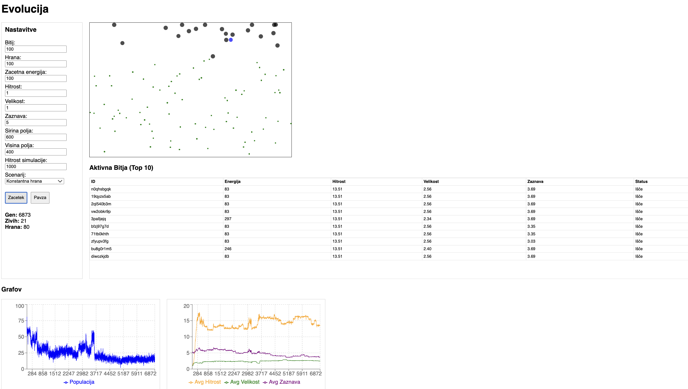
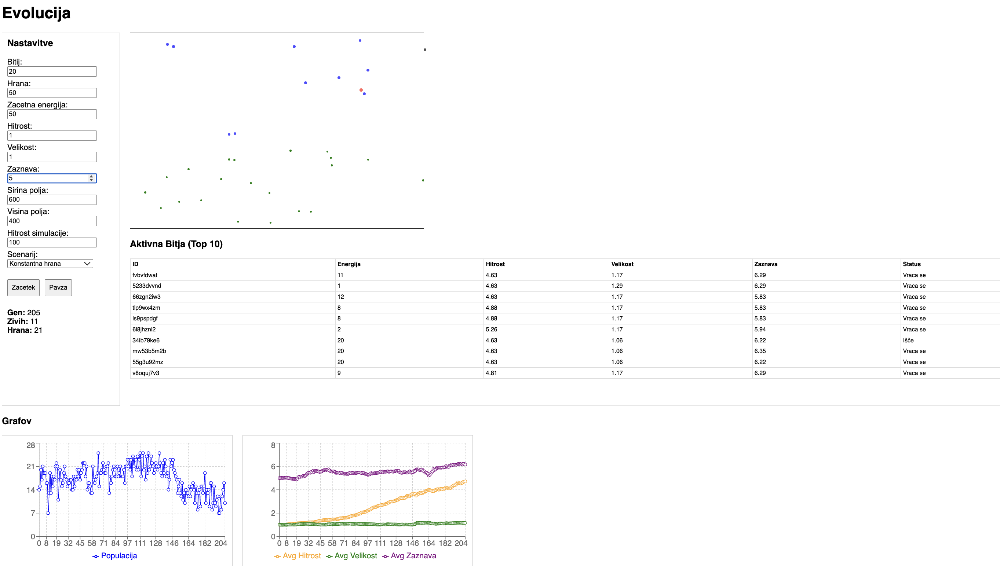
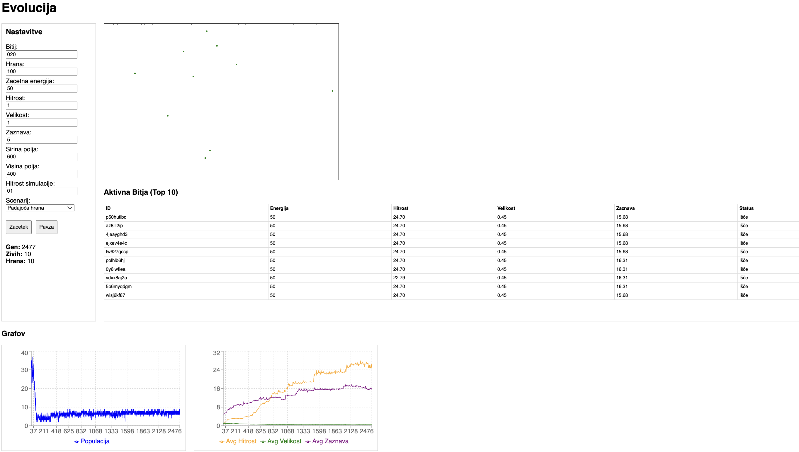

# Poročilo o simulaciji evolucije bitij (Vaja 3)

V okviru tretje vaje smo analizirali razvoj bitij v različnih okoljskih pogojih. Opazovali smo, kako se spreminjajo trije ključni parametri bitij: **hitrost**, **velikost** in **zaznava**, glede na razpoložljivost hrane v okolju.

## 1. Veliko hrane

V scenariju, kjer je hrane na pretek, opazimo, da se vsi evolucijski parametri bitij povečajo. Ker energija ni omejujoč faktor, bitja razvijejo večjo hitrost, večjo velikost in boljšo zaznavo.

- **Selekcija**: Ni močnega pritiska na varčevanje z energijo.
- **Rezultat**: Bitja postajajo večja in močnejša, saj si lahko privoščijo visoko porabo energije za vzdrževanje vseh lastnosti.

## 2. Malo hrane / Konstantna hrana (Not much food / Constant food)

Ko je količina hrane omejena, postane najpomembnejši parameter **hitrost**. Bitja tekmujejo za omejene vire, zato tista, ki so hitrejša, prva dosežejo hrano in si s tem zagotovijo preživetje.

- **Selekcija**: Prednost imajo hitra bitja.
- **Rezultat**: Hitrost močno naraste, medtem ko se velikost in zaznava ne povečujeta tako izrazito, da bi bitja prihranila energijo za hitro gibanje.

## 3. Padajoča količina hrane (Reducing food)

V scenariju, kjer se količina hrane skozi generacije zmanjšuje, postaneta **hitrost** in **zaznava** (perception) enako pomembna faktorja. Bitja ne potrebujejo le hitrosti, da pridejo do hrane, ampak tudi dobro zaznavo, da jo v revnem okolju sploh najdejo.

- **Selekcija**: Bitja z visoko hitrostjo in zaznavo so najuspešnejša pri iskanju redkih virov.
- **Rezultat**: Skozi generacije opazimo sočasen dvig obeh parametrov, kar bitjem omogoča učinkovito iskanje hrane na večjih razdaljah.

## Zaključek

Simulacija je pokazala, da okolje neposredno vpliva na evolucijski razvoj lastnosti bitij. Medtem ko v izobilju uspevajo vse lastnosti, v pomanjkanju pridejo do izraza specifične prilagoditve, ki zagotavljajo čim bolj učinkovit dostop do energije.
