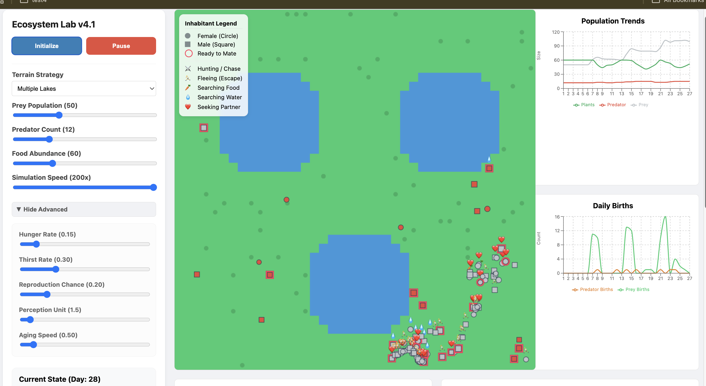
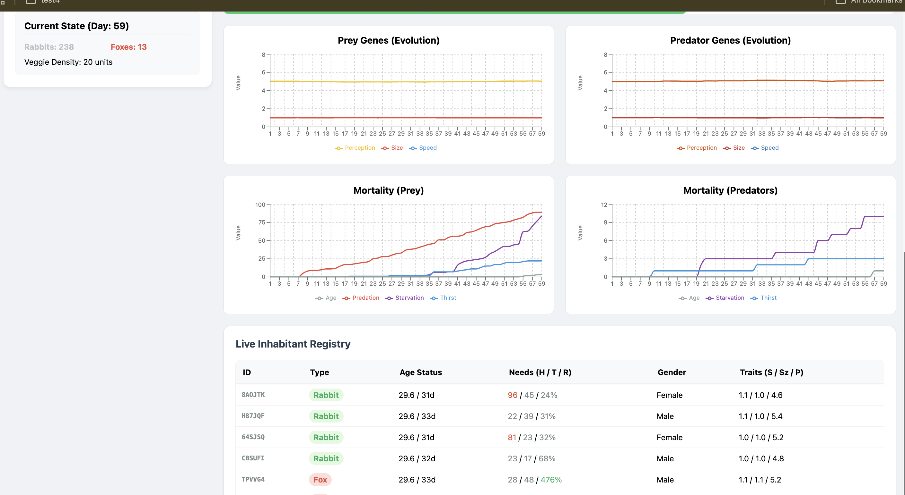

# Poročilo o vaji 4: Ekosistem

## Povzetek

Naredil sem 60 % naloge za vajo 4. Program je v stanju MVP (Minimum Viable Product). Simulacija deluje in vključuje osnovne funkcije.

## Opis dela

V simulaciji sem naredil naslednje stvari:

- **Teren:** Naredil sem štiri različne terene. Teren ima vodo in kopno. Bitja pijejo vodo in hodijo po kopnem.
- **Bitja:** V simulaciji so plenilci in plen.
- **Lastnosti:** Bitja imajo lakoto, žejo in potrebo po razmnoževanju. Imajo tudi starost, spol, hitrost in velikost.
- **Logika:** Bitja iščejo hrano in vodo. Če so preveč lačna ali žejna, umrejo. Razmnoževanje je glavna prioriteta.

## Ugotovitve

Simulacija kaže, kako bitja preživijo v okolju. Ugotovil sem naslednje:

- Nismo dosegli neskončnega cikla življenja. Bitja sčasoma umrejo zaradi starosti ali pomanjkanja virov.
- Če bi lahko nastavili drugačne parametre za vsako bitje posebej, bi bilo mogoče doseči daljše preživetje v prihodnosti.

## Slike simulacije

### Zemljevid terena

Tukaj je slika, ki prikazuje vodo in kopno v simulaciji.

### Grafi in statistika

Tukaj je slika, ki prikazuje statistiko bitij v času.

